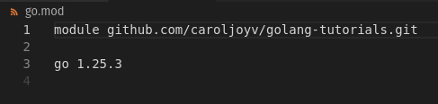

# This contains golang tutorials


1. Statically typed language
2. Strongly typed language
3. GO is compiled
4. Fast compile time
5. Built in concurrency
6. Simplicity
7. Garbage collection


# Initializing a Golang Project

## 2 concpets to know before starting

-- Package
    - a folder that contains a collection of go files.
    - Every go file belongs to a package.

-- Module
    - a collection of packages
    - when a new project is initialized, we are initializing a new module

### Initializing a golang project

```
go mod init <name of module/github remote url>
eg: go mod init github.com/caroljoyv/golang-tutorials.git
```

- This creates a go.mod folder.

- It contains the name of the go module and the go version.
- IF we use external modules, these will also be listed here.


## Getting Started
- File extension: .go
- Since every go file belongs to a package, we identify the package it belongs to at the top of the file by typing package and then the name of the package which has to be the same for all files within the folder. 

eg: 
```
package main
```
- This is a special package name that tell the compiler to look for the entry point function here, ie, when creating an executable, the compiler needs to know where the program should start from and it should look for a function named main within this main package which serves as a first thing that gets executed in a program.

- The main function is required in a main package.

- Go doesn't le you import packages and not use them.
- Comments - 
    - single line comments: //
    - multi-line comments: /* ---- */

- fmt.Println(): Prints the string that is passed in along with a new line at the end.


## Running the golong code file
- To compile, use
    ```
        go build <file path>
    ```
- This creates a binary file that can be run. If the go file name is ```test.go```, then the name of the binary will be ```test```.
- To run the binary, use
    ```
        ./<binary path>
    ```

- To compile and run the file in a single command, use
    ```
        go run <file path>
    ```
    


